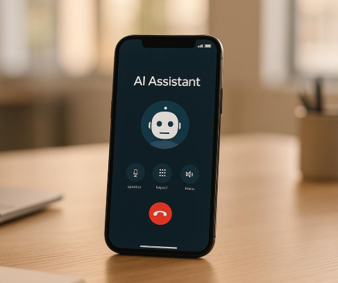

# AI Phone Agent Starter Kit

**A production-oriented starter kit for building AI agents that answer real phone calls and talk to customers in real time using OpenAI’s [Realtime API](https://platform.openai.com/docs/guides/realtime).**

This project is a **Node.js / TypeScript backend** you connect to **Twilio** or **Amazon Connect**. Callers dial a normal business number; audio flows into your server and to **OpenAI Realtime**, so the AI can listen, speak, run tools (hang up, transfer to a human, collect structured info), and optionally use **[MCP](https://modelcontextprotocol.io/)**-backed tools. It is built for teams that want a **clear, deployable baseline** for **phone-first** voice agents—not a generic demo, but patterns you can ship and replace with your own product logic.

<p align="center">
  
</p>

**Requires Node.js ≥ 16.**

## Try it (live)

**Call [+1 (855) 522-2348](tel:+18555222348)** — a sample **AI Phone Agent** built from this kit on **Amazon Connect** and OpenAI’s phone integration. The AI behaves like a front-line agent: **real-time** conversation, **trip intent** capture, and answers to **trip-related** questions (demo behavior; not production advice).

## Purpose

This starter kit exists to help you **go from zero to a working AI phone agent** without stitching together every integration by trial and error. It provides:

- **Two proven call paths** — **Twilio Media Streams** for programmable voice, and **Amazon Connect** wired to OpenAI’s **phone / SIP** flow (incoming webhook + accept + streaming session).
- **Realtime voice end-to-end** — bidirectional audio with OpenAI Realtime, plus **function tools** wired for real calls (e.g. trip intake, transfer to agent, disconnect).
- **Operational glue** — Express HTTP + WebSocket, **`/status`** / **`/status.json`** to see what’s enabled and which URLs to expose through a tunnel (ngrok, etc.).
- **Optional MCP** — HTTP MCP servers you can attach for richer tools; example **booking** / **post-booking** MCP code is included as **reference only**.

**Scope:** this repo is **phone-only**. It does **not** ship a browser microphone UI or web voice client—only **telephony integrations** (Twilio and Connect) into this backend.

## Key features

- **Realtime phone conversations** — AI answers, interrupts naturally, and responds with low-latency speech via OpenAI Realtime.
- **Twilio integration** — TwiML entry + **Media Streams** WebSocket (`/twilio-phone/incoming-call`, `/twilio-phone/media-stream`) for classic programmable voice setups.
- **Amazon Connect integration** — OpenAI **incoming-call** webhook at **`/amazon-connect-phone/incoming-call`** (default; override with `AMAZON_CONNECT_PHONE_WEBHOOK_BASE_PATH`) + **accept** flow and streaming session in `openai-sip-webhook/` (see docs).
- **Call tools that matter on the phone** — example tools include structured **trip / intake** updates, **transfer to human**, and **hang up**, with scheduling so transfers don’t cut off the assistant mid-sentence.
- **Optional MCP servers** — plug in Model Context Protocol HTTP servers for discoverable tools; sample MCP implementations are starting points for your own backends.
- **TypeScript throughout** — `@/*` path aliases, compiled to `dist/` with **`tsc-alias`** for clean imports.

## Demo code vs. your product

The **booking MCP**, **post-booking MCP**, and **trip-intake-style** tools in this repo are **illustrative**. They show how to wire tools and MCP into a phone agent. **Replace them** with your own agents, prompts, and MCP servers to match your business and compliance requirements.

## Layout

- **`src/foundation/`** — OpenAI agents & helpers, MCP servers, Twilio WebSocket (`/twilio-phone/media-stream`), Amazon Connect SDK.
- **`src/service/`** — `twilio-phone`, `amazon-connect-phone` (OpenAI SIP webhook under `openai-sip-webhook/`).

TypeScript **`@/*` → `src/*`**; **`tsc-alias`** rewrites imports in `dist/`.

Entry: **`src/index.ts`** — `initTwilioPhoneChannel`, `initAmazonConnectPhoneChannel`, `initMcpServers`.

## Quick start

```sh
npm install
cp .env.example .env   # set OPENAI_API_KEY, etc.
npm run dev
```

Server default: `http://localhost:4000`. **`GET /status`** and **`GET /status.json`** list enabled channels and URLs.

## Environment (summary)

See **`.env.example`**. Typical keys:

- `OPENAI_API_KEY`, `OPENAI_MODEL` (e.g. `gpt-realtime-1.5`)
- `PORT` (default `4000`)
- **Twilio**: `TWILIO_PHONE_ENABLE`, `TWILIO_WEBHOOK_URL` (wss Media Stream URL)
- **Amazon Connect + SIP**: `AMAZON_CONNECT_PHONE_ENABLE`, `AMAZON_CONNECT_PHONE_WEBHOOK_BASE_PATH`, optional `AMAZON_CONNECT_SDK_ENABLE` + AWS

## Docs

| Doc | Topic |
|-----|--------|
| [doc/ai-phone-agent-architecture.md](./doc/ai-phone-agent-architecture.md) | Architecture |
| [doc/twilio-integration.md](./doc/twilio-integration.md) | Twilio |
| [doc/amazon-connect-openai-webhook.md](./doc/amazon-connect-openai-webhook.md) | Connect + OpenAI SIP |
| [doc/local-testing-twilio-and-amazon-connect-sip.md](./doc/local-testing-twilio-and-amazon-connect-sip.md) | ngrok / tunnels |

## Scripts

- `npm run dev` — nodemon
- `npm run build` / `npm run start` — compile + `node dist/index.js`
- `npm run lint` — ESLint
- `npm run format` — Prettier

## License

MIT
