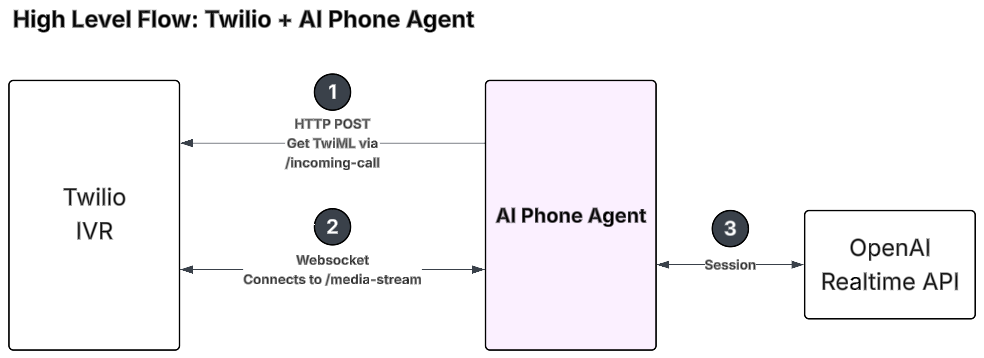

# Twilio Phone Integration Guide

This document describes **Twilio Media Streams** phone integration for this server.

**Local testing (ngrok / tunnel, env vars):** [local-testing-twilio-and-amazon-connect-sip.md](./local-testing-twilio-and-amazon-connect-sip.md).

## Overview

- 📞 **PSTN via Twilio**: TwiML `/twilio-phone/incoming-call` and WebSocket `/twilio-phone/media-stream` using `TwilioRealtimeTransportLayer` and OpenAI Realtime.

## Architecture

### High-level flow



1. **HTTP POST** — Twilio requests TwiML from **`/twilio-phone/incoming-call`** (see the HTTP route handler under [Components](#components)).
2. **WebSocket** — Twilio opens a Media Stream to **`/twilio-phone/media-stream`** for bidirectional audio.
3. **Session** — The backend runs a **Realtime** session with OpenAI (via `TwilioRealtimeTransportLayer` and `frontDeskAgentForPhone`; details below).

### Components

#### 1. HTTP Route Handler (`/twilio-phone/incoming-call`)

**Location**: `src/service/twilio-phone/http-route.ts` (`initTwilioPhoneHttpRoute`)

**Purpose**: Handles incoming call webhooks from Twilio

**Implementation** (path is `TWILIO_PHONE_INCOMING_CALL_PATH` in `src/service/twilio-phone/constants.ts`):
```typescript
app.all('/twilio-phone/incoming-call', (req, res) => {
  const mediaStreamUrl = process.env.TWILIO_WEBHOOK_URL
  
  const twimlResponse = `
    <?xml version="1.0" encoding="UTF-8"?>
    <Response>
      <Connect>
        <Stream url="${mediaStreamUrl}" />
      </Connect>
    </Response>
  `
  
  res.type('text/xml').send(twimlResponse)
})
```

**Key Points**:
- Handles both GET and POST requests
- Returns TwiML XML response
- Configurable via `TWILIO_PHONE_ENABLE` and `TWILIO_WEBHOOK_URL` environment variables
- Logs caller ID for tracking

#### 2. WebSocket Server (`/twilio-phone/media-stream`)

**Location**: `src/foundation/websocket/endpoints/twilio-phone/` (`initTwilioPhoneMediaStreamWebSocketServer`, used by `initTwilioPhoneChannel`)

**Purpose**: Handles Twilio Media Stream WebSocket connections

**Key Features**:
- Uses native WebSocket (not Socket.IO) to avoid conflicts
- Manual upgrade handling for `/twilio-phone/media-stream` path only
- Creates isolated session per phone call
- Uses `TwilioRealtimeTransportLayer` from `@openai/agents-extensions`

**Implementation Highlights**:
- **Immediate Connection**: Follows "Speed is the name of the game" principle:
  1. Create transport layer IMMEDIATELY
  2. Create session IMMEDIATELY (without waiting for MCP servers)
  3. Connect IMMEDIATELY (user can start talking right away)
  4. Connect MCP servers in background and update agent asynchronously

- **Greeting Management**: Sends greeting message after session is ready
- **Call ID Tracking**: Extracts call ID from Twilio messages for logging
- **Session Cleanup**: Properly closes session and MCP connections on disconnect

#### 3. Transport Layer

**Type**: `TwilioRealtimeTransportLayer` from `@openai/agents-extensions`

**Purpose**: Bridges Twilio Media Stream protocol with OpenAI Realtime API

**Features**:
- Automatic audio format conversion
- Bidirectional audio streaming
- Protocol translation between Twilio and OpenAI

#### 4. Phone Session Agent

**Location**: `src/foundation/open-ai/agents/general-agents/phone-session-agent/`

**Purpose**: Retrieves customer phone session data based on phone number

**Tool**: `get_phone_session`
- **Input**: Phone number
- **Output**: Phone session data including:
  - Customer phone number
  - Product name (hotel, car rental, flight)
  - Destination city
  - Booking dates (start/end)
  - Hotel name and address
  - Number of guests and rooms

**Usage**: The agent can call this tool to retrieve customer context at the start of a conversation.

#### 5. Front Desk Agent for Phone

**Location**: `src/foundation/open-ai/agents/realtime-phone/front-desk-agent/`

**Purpose**: Specialized AI agent optimized for phone-based customer service

**Key Features**:
- **Phone-Optimized Instructions**: Tailored conversation flow for phone interactions
- **Immediate Acknowledgments**: Always responds immediately before tool calls
- **Phone Session Integration**: Automatically retrieves customer context
- **Tool Calling Protocol**: Proper user feedback during tool execution
- **Voice Selection**: Uses 'marin' voice (optimized for phone)

**Instructions Structure**:
1. **General Instructions**: Role, behavior, basic rules
2. **Customer Phone Session**: How to use phone session data
3. **Conversation Instructions**: How to start and maintain conversations
4. **Conversation Examples**: Example interactions

**Available Tools**:
- `get_phone_session` - Retrieve customer context
- `hotel_info_search_expert` - Search hotel information
- `hotel_booking_expert` - Book hotels
- `car_rental_booking_expert` - Book car rentals
- `flight_booking_expert` - Book flights
- `post_booking_expert` - Post-booking operations
- `checkout_expert` - Checkout process

## Configuration

### Environment Variables

```env
# Required for Twilio integration
TWILIO_PHONE_ENABLE=true
TWILIO_WEBHOOK_URL=wss://your-domain.com/twilio-phone/media-stream

# Required for OpenAI
OPENAI_API_KEY=your_openai_api_key_here
OPENAI_MODEL=gpt-realtime-1.5

# Optional
PORT=4000
```

### Twilio Console Configuration

1. **Phone Number Setup**:
   - Go to Twilio Console → Phone Numbers → Manage → Active numbers
   - Select your phone number
   - In "Voice & Fax" section:
     - **Webhook URL**: `https://your-domain.com/twilio-phone/incoming-call`
     - **HTTP Method**: `POST`

2. **Media Streams**:
   - The backend automatically handles Media Stream connections
   - No additional Twilio configuration needed

## Local Development

### Using ngrok

1. **Start ngrok**:
   ```bash
   ngrok http 4000
   ```

2. **Update `.env`**:
   ```env
   TWILIO_PHONE_ENABLE=true
   TWILIO_WEBHOOK_URL=wss://abc123.ngrok.io/twilio-phone/media-stream
   ```

3. **Configure Twilio Webhook**:
   - URL: `https://abc123.ngrok.io/twilio-phone/incoming-call`
   - Method: `POST`

### Testing Phone Calls

1. Call your Twilio phone number
2. Backend receives POST to `/twilio-phone/incoming-call`
3. Returns TwiML with Stream directive
4. Twilio connects to `/twilio-phone/media-stream` WebSocket
5. AI agent greets and handles conversation

## Production Deployment

### Requirements

1. **HTTPS/WSS Support**: Server must support secure WebSocket connections
2. **Public Domain**: Server must be accessible from internet
3. **WebSocket Upgrade**: Server must handle WebSocket upgrades on `/twilio-phone/media-stream` path

### Deployment Steps

1. **Deploy Backend**:
   ```bash
   npm run build
   npm run start
   ```

2. **Set Environment Variables**:
   ```env
   TWILIO_PHONE_ENABLE=true
   TWILIO_WEBHOOK_URL=wss://your-production-domain.com/twilio-phone/media-stream
   ```

3. **Configure Twilio**:
   - Update webhook URL to production endpoint
   - Test with a phone call

### Server Configuration

Ensure your server/proxy (nginx, etc.) allows WebSocket upgrades:

**nginx example**:
```nginx
location /twilio-phone/media-stream {
    proxy_pass http://localhost:4000;
    proxy_http_version 1.1;
    proxy_set_header Upgrade $http_upgrade;
    proxy_set_header Connection "upgrade";
    proxy_set_header Host $host;
    proxy_set_header X-Real-IP $remote_addr;
}
```

## Session Management

### Per-Call Isolation

Each phone call gets:
- **Isolated WebSocket connection**
- **Dedicated RealtimeSession**
- **Separate MCP server connections**
- **Unique call ID** for tracking

### Session Lifecycle

1. **Call Initiated**: Twilio sends POST to `/twilio-phone/incoming-call`
2. **TwiML Response**: Server returns Stream directive
3. **WebSocket Connection**: Twilio connects to `/twilio-phone/media-stream`
4. **Session Creation**: Backend creates RealtimeSession immediately
5. **MCP Connection**: MCP servers connect in background
6. **Agent Update**: Agent updated with MCP servers after connection
7. **Greeting Sent**: AI agent greets customer
8. **Conversation**: Real-time bidirectional audio streaming
9. **Call End**: WebSocket closes, session and MCP connections cleaned up

### Error Handling

- **Connection Errors**: Logged and WebSocket closed gracefully
- **Session Errors**: Logged, session closed, cleanup performed
- **MCP Errors**: Non-critical, logged as warnings, agent continues without MCP

## Performance Optimizations

### Speed Optimization

Following OpenAI's "Speed is the name of the game" principle:

1. **Immediate Transport Layer**: Created before any async operations
2. **Immediate Session**: Created without waiting for MCP servers
3. **Immediate Connection**: Connected to OpenAI immediately
4. **Background MCP**: MCP servers connect in parallel after session is ready
5. **Async Agent Update**: Agent updated with MCP servers asynchronously

### Result

- **User can start talking immediately** after call connects
- **No waiting** for MCP servers to connect
- **Optimal user experience** with minimal latency

## Monitoring & Logging

### Key Log Events

- `[Twilio] Incoming call received` - Call webhook received
- `[Twilio Media Stream] WebSocket connection established` - WebSocket connected
- `[Twilio Media Stream] Connected to OpenAI Realtime API immediately` - Session ready
- `[Twilio Media Stream] Agent updated with MCP servers successfully` - MCP ready
- `[Twilio Media Stream] Greeting sent` - Greeting message sent
- `[Twilio Media Stream] WebSocket connection closed` - Call ended

### Call Tracking

- **Call ID**: Extracted from Twilio messages (`callSid`)
- **Phone Number**: Logged from incoming call webhook
- **Session State**: Tracked throughout call lifecycle

## Troubleshooting

### Common Issues

1. **WebSocket Connection Fails**:
   - Check `TWILIO_WEBHOOK_URL` uses `wss://` (not `ws://`)
   - Verify server supports WebSocket upgrades
   - Check firewall/security group settings

2. **No Audio**:
   - Verify OpenAI API key is set
   - Check session connection status in logs
   - Verify transport layer is working

3. **MCP Tools Not Available**:
   - Check MCP server connection logs
   - Verify MCP servers are running
   - Check network connectivity

4. **Greeting Not Sent**:
   - Check call ID extraction
   - Verify session is connected
   - Check greeting record logic

## Future Enhancements

Potential improvements:
- [ ] Dynamic phone number routing
- [ ] Call recording integration
- [ ] Real-time call analytics
- [ ] Multi-language support
- [ ] Call transfer capabilities
- [ ] Integration with CRM systems

## References

- [Twilio Media Streams Documentation](https://www.twilio.com/docs/voice/twiml/stream)
- [OpenAI Agents Extensions](https://github.com/openai/agents-extensions)
- [OpenAI Realtime API](https://platform.openai.com/docs/guides/realtime)

